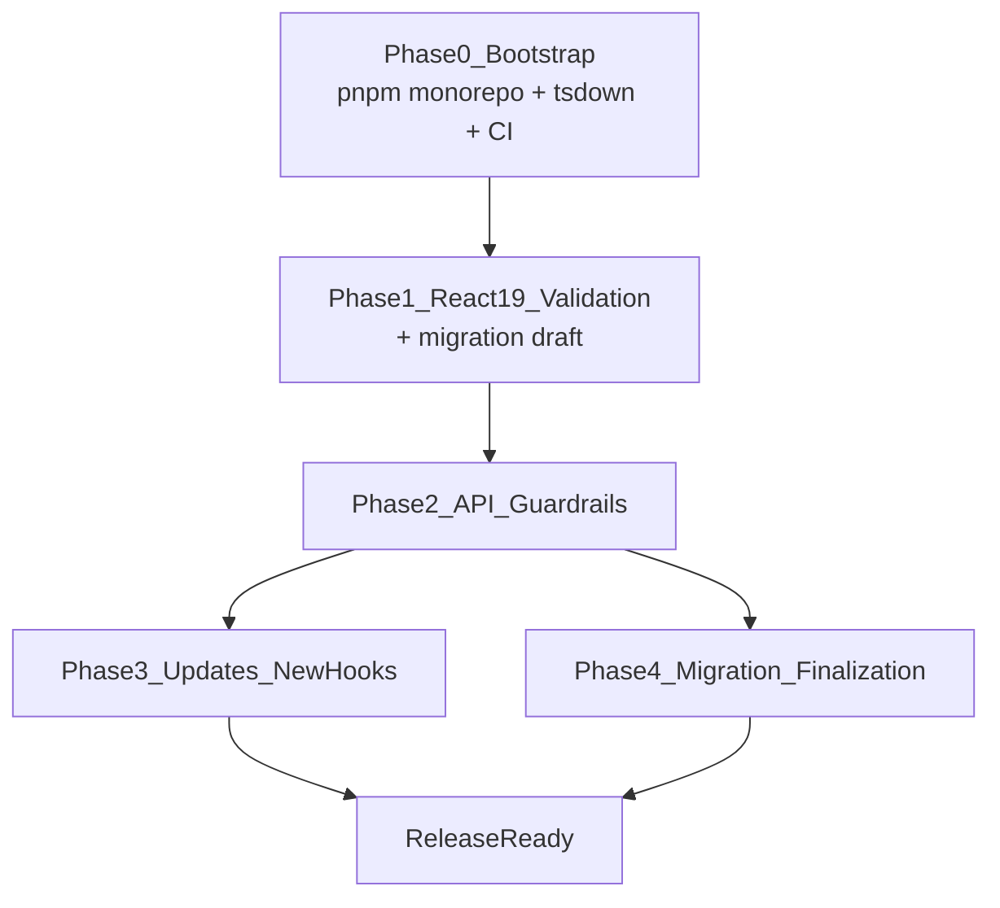

# @ts-hooks-kit/core Compatibility Plan

## Goals

- Ship `@ts-hooks-kit/core` as a maintained library based on `usehooks-ts`.
- Phase 1: upgrade dependencies/tooling and verify React 19 compatibility first.
- Phase 2: continue hook updates/additions while preserving API compatibility semantics.
- Use new import path (`@ts-hooks-kit/core`) with migration support from `usehooks-ts`.

## Scope Decisions Locked

- Package name: `@ts-hooks-kit/core`.
- Bootstrap strategy: import/copy upstream `usehooks-ts` baseline, then upgrade.
- Import compatibility: new package import path + codemod + migration docs (not strict old package path).
- Runtime/tooling baseline: modern stack (`Node >=20`) is the default support target.
- Fallback policy: users constrained to older Node should remain on upstream `usehooks-ts`.

## Tooling Decisions

### Build tool: tsdown

- **tsdown** is the successor to tsup, built on the Rust-based Rolldown engine (powers Vite 8).
- Near-identical config API to tsup — `tsdown migrate` automates conversion from upstream tsup config.
- Faster builds and significantly faster `.d.ts` generation (built-in, no separate rollup-dts step).
- Produces ESM + CJS dual output with better CJS interop than esbuild.
- Fallback: if a pre-1.0 tsdown bug is hit, revert to tsup (same config format).

### Package manager: pnpm

- Industry standard for published libraries (8/10 major React hook libraries use pnpm).
- Rock-solid npm publish pipeline — no registry, `.npmrc`, or workspace protocol issues.
- Strict dependency enforcement prevents phantom dependencies.
- Mature CI support (GitHub Actions `pnpm/action-setup`).

### Repository structure: minimal monorepo (pnpm workspaces, no Turborepo)

Monorepo is needed because the project includes both a publishable package and a community docs site. Docs must stay in sync with code (atomic PRs for hook + doc changes). However, Turborepo/Nx are unnecessary for 2 packages — pnpm workspaces alone is sufficient.

Reference: TanStack Query, ahooks, shadcn/ui, and Mantine all use monorepo with docs co-located. This is the community standard for libraries with documentation sites.

```
ts-hooks-kit/
├── packages/
│   └── core/                  # @ts-hooks-kit/core
│       ├── src/               # hooks source (preserves upstream layout)
│       ├── tsdown.config.ts
│       ├── vitest.config.ts
│       ├── tsconfig.json
│       └── package.json
├── apps/
│   └── docs/                  # docs site (VitePress)
│       ├── .vitepress/
│       ├── guide/
│       └── package.json
├── pnpm-workspace.yaml        # packages: ['packages/*', 'apps/*']
├── tsconfig.base.json         # shared TypeScript config
├── .eslintrc.js               # shared lint config
├── package.json               # root scripts
├── docs/                      # non-site docs (migration.md, compatibility.md)
└── CHANGELOG.md
```

Root scripts (no Turborepo needed):
```json
{
  "scripts": {
    "build": "pnpm -r build",
    "test": "pnpm --filter @ts-hooks-kit/core test",
    "test:codemod": "pnpm --filter @ts-hooks-kit/codemod test",
    "dev:docs": "pnpm --filter @ts-hooks-kit/docs dev",
    "lint": "pnpm -r lint",
    "codemod": "node packages/codemod/bin/ts-hooks-kit-codemod.js",
    "migrate:test": "node packages/codemod/bin/ts-hooks-kit-codemod.js examples/sample-app --pattern \"**/*.{ts,tsx,cjs}\" --dry"
  }
}
```

### lodash.debounce decision: replace with internal implementation

Upstream carries `lodash.debounce` as a production dependency. Decision: **replace with a lightweight internal debounce utility (~30 lines)**.

Rationale:
- `lodash.debounce` was last published in 2021 — effectively unmaintained.
- No ESM export — causes bundler warnings and CJS interop friction.
- Pulls in `lodash._root` internal dependency.
- ~1.5 KB for functionality that takes ~0.3 KB to implement.
- A hooks library should minimize its dependency tree.

The internal implementation must support the full API surface used by `useDebounceCallback`:
- Basic delay-based debouncing
- `leading` / `trailing` options
- `maxWait` option
- `.cancel()` and `.flush()` control methods

This makes `@ts-hooks-kit/core` a **zero-dependency** package (React as peer only).

Implementation: Phase 1, as part of the dependency audit. Must pass all existing `useDebounceCallback` and `useDebounceValue` tests with no behavioral changes.

### Note on upstream React 19 peer support

Upstream `usehooks-ts` already declares `^19` in `peerDependencies`. Phase 1 is therefore focused on **validating runtime behavior** against React 19 (not just declaring peer support), specifically:
- Upgrading `@testing-library/react` from v14 → v16 (React 19 compatible)
- Upgrading `@types/react` from `18.2.73` → `^19`
- Auditing hooks for effect timing, SSR, and deprecated pattern differences

## Dependency Baseline and Target

Reference baseline source:

- `[/Users/mac/WebApps/oss/custom-hooks-ts/usehooks-ts/packages/usehooks-ts/package.json](/Users/mac/WebApps/oss/custom-hooks-ts/usehooks-ts/packages/usehooks-ts/package.json)`

Context7 checks used:

- React library ID: `/facebook/react` (versions include `v19_2_0`)
- Vitest library ID: `/vitest-dev/vitest` (versions include `v4.0.7`)
- Testing Library docs library ID: `/testing-library/testing-library-docs`

Planned dependency targets for Phase 1:

- `react` peer range: include `^19.2.0` while keeping backward-compatible range in first compatibility release
  - candidate peer: `^18 || ^19`
- `react-dom` peer: add only if runtime hooks require it; otherwise keep package React-only to match upstream style
- `@types/react`: move from `18.2.73` baseline to `^19`
- `@types/react-dom`: add `^19` only if test/app harness requires direct DOM typings
- `vitest`: upgrade from `^1.3.1` baseline to `^4.0.7` for active maintenance
  - constraint: Vitest v4 requires Node `>=20` and Vite `>=6`
- `@testing-library/react` and `@testing-library/jest-dom`: upgrade to current React 19-compatible majors during Phase 1 test-matrix setup
- `typescript`: keep at least upstream baseline `^5.3.3`; prefer newer stable if required by React 19 types/test stack

Dependency validation gate (must pass before Phase 2):

- Lock final versions in `package.json` and capture rationale in `docs/compatibility.md`
- Run matrix tests on React 18 and React 19 with the final dependency set
- Confirm no API signature drift in exported hooks after dependency upgrades
- Confirm migration docs state Node support policy and explicit fallback path to upstream `usehooks-ts` for legacy Node environments

## Phase Plan

### Phase 0 — Bootstrap Repository Baseline

Phase 0 checklist:

- [ ] Initialize pnpm monorepo workspace structure (see "Repository structure" above).
- [ ] Set up `packages/core/` with tsdown build config (migrate from upstream tsup config via `tsdown migrate`).
- [ ] Import upstream source baseline from `usehooks-ts` release line (pin exact upstream tag/commit in docs).
- [ ] Preserve upstream hook filenames/exports layout initially to minimize diff noise.
- [ ] Set up CI pipeline (GitHub Actions):
  - [ ] Build + test on push/PR
  - [ ] React 18 + React 19 test matrix from day one
  - [ ] Node 20 runner
- [ ] Scaffold `apps/docs/` with chosen docs framework (framework decision TBD).
- [ ] Create foundational docs:
  - [ ] `[/Users/mac/WebApps/oss/custom-hooks-ts/ts-hooks-kit/docs/migration.md](/Users/mac/WebApps/oss/custom-hooks-ts/ts-hooks-kit/docs/migration.md)`
  - [ ] `docs/compatibility.md`
  - [ ] `CHANGELOG.md`

Deliverable:

- Buildable baseline package with unchanged API surface behavior (before React 19 changes).
- CI pipeline running tests against React 18 + 19.
- Monorepo structure with docs site scaffold.

### Phase 1 — React 19 Compatibility Validation

Note: upstream already declares `^19` in peerDependencies. This phase validates **actual runtime compatibility**, not just peer declaration.

- Update package/runtime constraints:
  - `peerDependencies`: React support includes 19 (`^18 || ^19` in first release).
  - Type dependencies move to React 19-compatible set (`@types/react` → `^19`).
- Upgrade test stack for React 19 runtime validation:
  - `@testing-library/react` v14 → v16 (React 19 compatible)
  - `vitest` ^1.3.1 → ^4.0.7 (requires Vite >=6, Node >=20)
  - `@testing-library/jest-dom` to current React 19-compatible major
- Update build config: tsdown (migrated from upstream tsup).
- Audit hooks with React-sensitive behavior and patch as needed (effects timing assumptions, SSR-safe guards, deprecated patterns).
- Replace `lodash.debounce` with internal debounce utility (~30 lines, zero dependencies). Must pass all existing debounce hook tests.
- Run full compatibility test matrix:
  - React 18 + React 19
  - TypeScript versions you support
  - SSR/basic hydration smoke checks
- Begin migration guide and codemod alongside this phase (moved from Phase 4 — the import rewrite is trivial and benefits early adopters).
- Publish first maintained release candidate under `@ts-hooks-kit/core`.

Deliverable:

- React 19-compatible stable baseline with parity-focused behavior.
- Draft migration guide and working codemod available for early testing.

### Phase 2 — API Compatibility Guardrails

- Freeze and document public API contract from imported baseline:
  - exported hook names
  - function signatures/types
  - module entry points
- Add automated API checks:
  - export snapshot test
  - type-level contract tests for critical hooks
- Define compatibility policy:
  - additive changes in minor
  - breaking changes only in major with migration notes

Deliverable:

- CI-enforced API compatibility safety net for future development.

### Phase 3 — Continued Updates and New Hooks

**Status: Completed** — 17 new hooks added following strict TDD (Test-Driven Development).

New hooks implemented (all with full TypeScript support, tests, and React 18/19 compatibility):

#### Tier 1 — Essential Production Hooks (8 hooks)
| Hook | Description | API |
|------|-------------|-----|
| `usePrevious` | Track previous state/props value | `const prev = usePrevious(value, initial?)` |
| `useSet` | Manage Set data structure with reactive updates | `const [set, { add, remove, toggle, has, clear, reset }]` |
| `useQueue` | FIFO queue data structure management | `const [queue, { add, remove, clear, first, last, size }]` |
| `useList` | Enhanced array state management | `const [list, { set, push, updateAt, insertAt, removeAt, clear, reset }]` |
| `useAsync` | Async function state with loading/error | `const { value, error, loading, retry } = useAsync(fn, deps?)` |
| `useUpdateEffect` | useEffect that skips initial mount | `useUpdateEffect(effect, deps)` |
| `useThrottle` | Throttle execution (fn + value variants) | `useThrottleFn(fn, wait)` / `useThrottle(value, wait)` |
| `useMemoizedFn` | Stable function reference without deps | `const stableFn = useMemoizedFn(fn)` |

#### Tier 2 — Browser API & UX Hooks (6 hooks)
| Hook | Description | API |
|------|-------------|-----|
| `useGeolocation` | Browser geolocation API wrapper | `const { latitude, longitude, accuracy, loading, error }` |
| `useNetwork` | Network status monitoring | `const { online, effectiveType, downlink } = useNetwork()` |
| `usePermission` | Browser permissions API | `const { state, supported } = usePermission(name)` |
| `usePageLeave` | Detect when user leaves page | `usePageLeave(handler)` |
| `useIdle` | Detect user idle state | `const { idle, lastActive } = useIdle(timeout, options?)` |
| `useUpdate` | Force component re-render | `const update = useUpdate()` |

#### Tier 3 — Advanced State Management (3 hooks)
| Hook | Description | API |
|------|-------------|-----|
| `useStateList` | Navigate through list of states | `const { state, next, prev, setState, isFirst, isLast }` |
| `usePagination` | Pagination logic with range generation | `const { activePage, range, setPage, next, prev, first, last }` |
| `useDisclosure` | Modal/drawer disclosure state | `const [opened, { open, close, toggle }] = useDisclosure()` |

**Testing Summary:**
- All 17 new hooks implemented via strict TDD (Red-Green-Refactor)
- 274 total tests passing (including 17 new test files)
- Zero breaking changes to existing 33 hooks
- Zero new runtime dependencies (React peer only)

- Compare periodically against upstream `usehooks-ts` changes and backport relevant fixes.
- Add new hooks under clear policy:
  - no breaking behavior to existing hooks
  - consistent naming/docs/testing standards
- Versioning/release cadence with changelog discipline.

Deliverable:

- Actively maintained fork-plus evolution path while preserving compatibility expectations.

### Phase 4 — Migration Experience (finalization)

**Status: Completed**

Note: Migration guide and codemod work begins in Phase 1. This phase is finalized and published.

- Migration guide completed in `docs/migration.md` with:
  - old import -> new import examples
  - known behavior differences
  - version mapping table (`usehooks-ts` baseline to `@ts-hooks-kit/core`)
  - migration validation checklist
- Codemod finalized in `packages/codemod/` for import rewrite:
  - `from "usehooks-ts"` -> `from "@ts-hooks-kit/core"`
  - supports `--dry` mode and `--pattern` filtering
- Migration docs published on docs site in `apps/docs/guide/migration.md`.
- Codemod verified on sample app at `examples/sample-app/`.

Deliverable:

- Low-friction migration path with minimal manual edits.
- Migration docs published on docs site.
- End-to-end codemod validation completed on sample app.

## Phase 4 Migration Guide

### Import Rewrite Examples

Named imports:

```ts
// before
import { useLocalStorage, useBoolean } from 'usehooks-ts'

// after
import { useLocalStorage, useBoolean } from '@ts-hooks-kit/core'
```

Namespace imports:

```ts
// before
import * as Hooks from 'usehooks-ts'

// after
import * as Hooks from '@ts-hooks-kit/core'
```

Type imports:

```ts
// before
import type { UseBooleanReturn } from 'usehooks-ts'

// after
import type { UseBooleanReturn } from '@ts-hooks-kit/core'
```

CommonJS require:

```js
// before
const hooks = require('usehooks-ts')

// after
const hooks = require('@ts-hooks-kit/core')
```

### Version Mapping

| usehooks-ts baseline | @ts-hooks-kit/core | Migration notes |
| --- | --- | --- |
| `3.1.1` | `0.1.0` | Source baseline pinned from upstream `usehooks-ts@3.1.1`, plus React 19 validation and 17 additional hooks |

### Known Behavior Differences

- Package name changes from `usehooks-ts` to `@ts-hooks-kit/core`; migration is import-path-only for baseline hooks.
- `@ts-hooks-kit/core` officially supports React `^18 || ^19` with CI matrix validation for React 18 and 19.
- Debounce internals use an in-repo implementation instead of `lodash.debounce`, while preserving the existing `useDebounceCallback` and `useDebounceValue` contract.
- `@ts-hooks-kit/core` includes 17 new hooks added in Phase 3; existing upstream baseline hooks remain compatibility-focused.

### Codemod Usage

Use the migration codemod from repository root:

```bash
node packages/codemod/bin/ts-hooks-kit-codemod.js <target-path> --dry
node packages/codemod/bin/ts-hooks-kit-codemod.js <target-path>
```

Default file glob:

```text
**/*.{js,jsx,ts,tsx,mjs,cjs,mts,cts}
```

### Migration Validation Checklist

- [ ] Run codemod with `--dry` and review planned rewrites.
- [ ] Run codemod without `--dry` and confirm all `usehooks-ts` imports are replaced.
- [ ] Search codebase for any remaining `usehooks-ts` references.
- [ ] Install `@ts-hooks-kit/core` and remove `usehooks-ts` from dependencies.
- [ ] Run application test suite and ensure no regressions.
- [ ] Run TypeScript type-check and ensure there are no import/type errors.
- [ ] Verify runtime behavior for hooks that depend on timers/storage/media queries.
- [ ] Update internal docs/snippets that still reference old package imports.

## Suggested Execution Order




## Acceptance Criteria

- Package `@ts-hooks-kit/core` builds (via tsdown), tests (via Vitest v4), and type-checks.
- Monorepo structure with pnpm workspaces: `packages/core/` + `apps/docs/`.
- React 19 is officially supported and validated in CI (React 18 + 19 matrix).
- Existing baseline hooks preserve API signatures and expected behavior.
- Migration doc + codemod are available and tested on at least one sample app.
- Docs site is deployed and includes migration guide.
- Release notes clearly communicate compatibility guarantees and upgrade steps.

